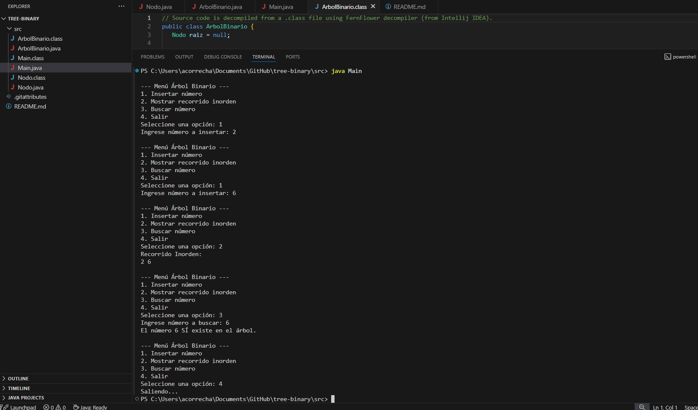

# Árbol Binario en Java

Este proyecto implementa un **árbol binario simple** en Java, permitiendo:

- Insertar números en el árbol.
- Mostrar el recorrido inorden.
- Buscar un número e indicar si existe.

## ¿Qué es un Árbol Binario?
Un árbol binario es una estructura de datos en la que cada nodo tiene como máximo **dos hijos**:
- Hijo izquierdo
- Hijo derecho

Se utiliza para organizar datos y poder insertarlos, buscarlos y ordenarlos de forma rápida.

**Ejemplo sencillo:**
Sí insertamos los números
8, 3, 10, 1, 6

El arbol queda así:
      8
     / \
    3   10
   / \
  1   6

Reglas:
- Los valores menores van a la izquierda.

- Los valores mayores van a la derecha.

Recorridos más comunes:

- InOrden (izq – raíz – der): imprime los datos en orden de menor a mayor.
- PreOrden (raíz – izq – der): primero la raíz y luego sus hijos.
- PostOrden (izq – der – raíz): primero los hijos y al final la raíz.

  Ejmplo de InOrden de el arbol anterios:
  1 3 6 8 10

  
## Implementación
- `Nodo.java` → Clase que representa cada nodo.
- `ArbolBinario.java` → Contiene los métodos para insertar, recorrer y buscar.
- `Main.java` → Menú en consola para interactuar con el usuario.

## Ejemplo de ejecución

